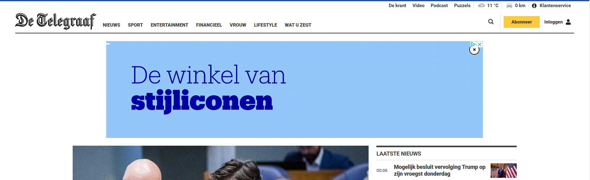
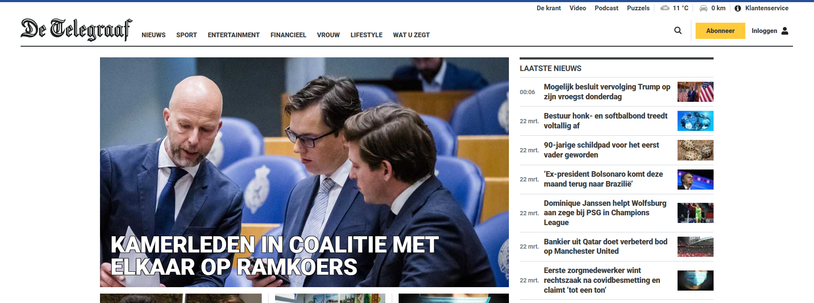
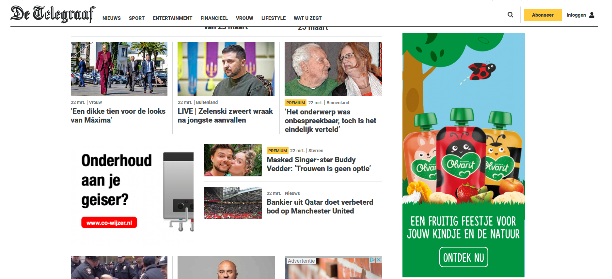
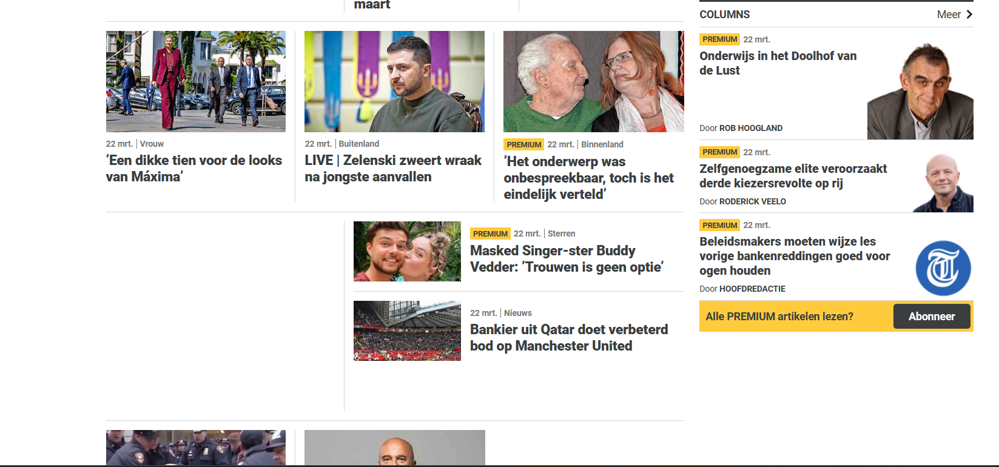
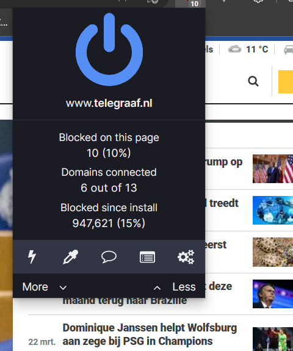

# BT-2023

## Afbeelding en custom fonts uitzetten

## Javascript & Content blockers

## Kleur aanzetten & Muis/trackpad werkt niet

## Breedband internet uitzetten & Cookies/Localstorage disabled

## Content blockers en ad blockers: wat blokkeren ze precies? :no_entry:

### Wat is een content blocker?
Een adblocker is software die gebruikt wordt om advertenties te blokkeren die verschijnen op de webbrowser of mobiele apparaten van een gebruiker. Dit wordt gedaan door de codes of scripts te identificeren en te blokkeren die verantwoordelijk zijn voor het weergeven van de advertenties op een webpagina.

### Hoe werkt een content blocker?
Normaal gesproken werkt een content blocker door de HTML en andere elementen van een webpagina te analyseren om vervolgens de ad-gerelateerde inhoud te identificeren en te blokkeren. Het kan de codes en scripts detecteren die door advertentienetwerken worden gebruikt en voorkomen dat deze worden uitgevoerd op de browser van de gebruiker. Adblockers kunnen ook specifieke URL's, domeinnamen of webpagina's blokkeren om te voorkomen dat advertenties verschijnen op bepaalde websites.

Adblockers kunnen ook tracking-scripts voorkomen, die door adverteerders worden gebruikt om jouw gedrag te volgen en hen te targeten met gepersonaliseerde advertenties. Door deze tracking-scripts te blokkeren, kan een adblocker de privacy van een gebruiker beschermen en voorkomen dat ze worden getarget door opdringerige advertenties.

### Wat kunnen gevolgen zijn van het gebruik van een content blocker?
Over het algemeen kan een adblocker een minder rommelige browse-ervaring bieden door afleidende en vervelende advertenties van websites te verwijderen.

Bij het gebruik van content en/of ad-blockers kan het zijn dat je mensen die afhankelijk zijn van advertenties voor hun inkomsten, zoals bijvoorbeeld bloggers of youtubers, niet meer kunt steunen. Door het blokkeren van advertenties, verliezen deze mensen een deel van hun inkomsten.
Dit kan een negatief effect hebben op de kwaliteit van de content die ze aanbieden.

Ook kan soms de content verschuiven of open plekken ontstaan, omdat de advertenties die daar stonden, niet meer worden weergegeven, waardoor soms het hele block niet meer wordt weergegeven of soms alleen de content van een block.

### Voorbeelden
De onderstaande voorbeelden is goed te zien wat een content blocker doet.

| Zonder adblocker | Met adblocker |
| -- | -- |
|  |  |
|  |  |

### Adblocker uitzetten
De adblocker die ik gebruik is uBlock Origin. Deze adblocker is te vinden in de Chrome Web Store. Om de adblocker uit te zetten, kan je rechtsboven in je browser op het icoontje klikken. Vervolgens kan je op de grote powerknop klikken om de adblocker uit te zetten.

