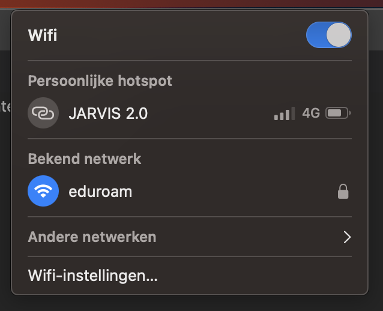
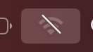
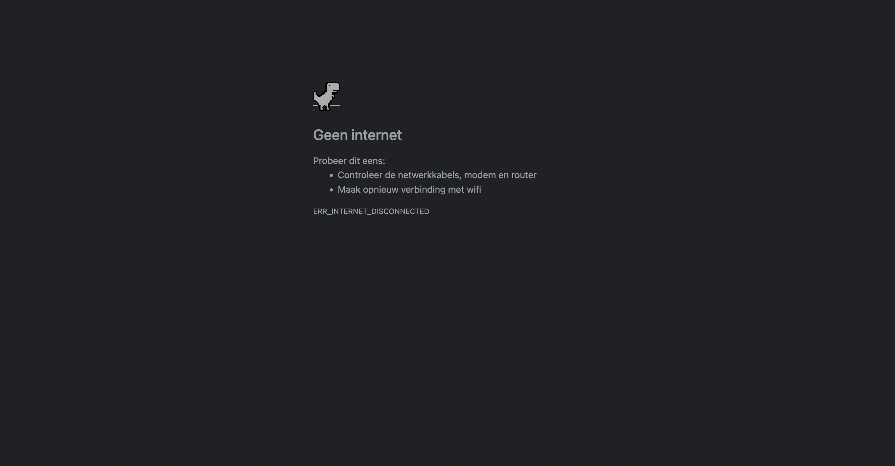
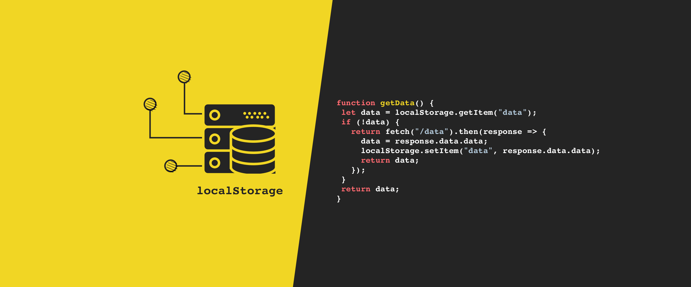

# BT-2023

## Afbeelding en custom fonts uitzetten

## Javascript & Content blockers

## Kleur aanzetten & Muis/trackpad werkt niet

## Breedband internet uitzetten & Cookies/Localstorage disabled

### Internet uitzetten
Wanneer u uw wifi-verbinding uitschakelt, zijn de websites die u eerder hebt bezocht niet langer toegankelijk en kunt u geen toegang krijgen tot nieuwe websites totdat u weer verbinding met internet maakt.

Websites worden gehost op servers die met internet zijn verbonden en wanneer u een website bezoekt, stuurt uw apparaat via internet een verzoek naar de server om de inhoud van de website op te halen. Als u uw wifi-verbinding uitschakelt, kan uw apparaat geen verzoeken meer naar internet verzenden en kan het dus geen website-inhoud ophalen.

Het is echter belangrijk op te merken dat sommige websites cachingmechanismen hebben waarmee ze tijdelijk bepaalde informatie op uw apparaat kunnen opslaan, zoals afbeeldingen of scripts. In dergelijke gevallen kunt u mogelijk nog steeds toegang krijgen tot sommige delen van de website, zelfs als u offline bent, maar de inhoud wordt pas bijgewerkt als u weer verbinding met internet maakt.

### Hoe doe je het internet uit(mac)?
|Wifi uitzetten|
|:---:|
||
|1. klik op de wifisymbool en vervolgens klik je op de blauwe schakelknop|

|Wifi uitzetten|
|:---:|
||
|2. Vervolgens zal je dit symbool zien|

Nou hoe ziet er nu uit in de browser :eyes:?

|Wifi uitzetten|
|:---:|
||
|3. In de voorbeeld hierboven hebben we gebruik gemaakt van google chrome om te laten zien hoe het eruit zal zien als de internet het niet deed.|

Hoe dit google chrome dit? 
De reden dat de game werkt, zelfs als je geen internetverbinding hebt, is dat deze eigenlijk in Google Chrome zelf is ingebouwd. Wanneer u op de spatiebalk drukt, opent de browser een nieuw tabblad met een eenvoudig HTML-, CSS- en JavaScript-spel dat volledig op uw computer draait.

### Wat werkt wel als je de internet uit doet?
1. Statische inhoud: Als een website statische inhoud heeft, zoals afbeeldingen, tekst of video's die zijn opgeslagen op het lokale apparaat, is deze nog steeds toegankelijk, zelfs als internet is uitgeschakeld.

2. Pagina's in cache: Als een website onlangs is bezocht en de webbrowser sommige pagina's in de cache heeft opgeslagen (opgeslagen), is het misschien mogelijk om toegang tot die pagina's te krijgen, zelfs als het internet is uitgeschakeld.

3. Lokale opslag: Sommige websites gebruiken lokale opslag om gegevens op het apparaat van de gebruiker op te slaan, zoals gebruikersvoorkeuren of eerder ingevoerde gegevens. Als de website deze functie heeft geïmplementeerd, is het misschien nog steeds mogelijk om toegang te krijgen tot deze gegevens, zelfs als internet is uitgeschakeld.

4. Sommige vormen van offline functionaliteit: Sommige websites zijn ontworpen met offline functionaliteit in het achterhoofd, zoals progressive web apps (PWA's). Dit soort websites zijn gebouwd om offline te werken door gegevens lokaal op te slaan en te synchroniseren met de server wanneer er weer een internetverbinding beschikbaar is.

## Localstorage :gear:
|Local storage|
|:---:|
||

Lokale opslag is een webopslagtechnologie aan de clientzijde waarmee webtoepassingen gegevens kunnen opslaan op de computer of het apparaat van de gebruiker. Het is een soort permanente opslag die kan worden gebruikt om gegevens lokaal op te slaan, zelfs nadat de gebruiker de browser sluit of de website verlaat.

Lokale opslag werkt door webapplicaties een interface te bieden voor het opslaan en ophalen van sleutel-waardeparen in de webbrowser van de gebruiker. De gegevens worden opgeslagen in een apart gedeelte van het geheugen van de browser, gescheiden van de browsercache of cookies.

Lokale opslag heeft verschillende voordelen ten opzichte van andere opslagopties aan de clientzijde, zoals cookies of sessieopslag. Het kan grotere hoeveelheden gegevens opslaan (tot enkele megabytes) en wordt niet bij elk verzoek teruggestuurd naar de server, waardoor het netwerkverkeer afneemt en de prestaties verbeteren. Bovendien zijn lokale opslaggegevens niet onderhevig aan vervaldatum of verwijdering, zoals cookies dat wel kunnen zijn.

Webapplicaties kunnen de localStorage API gebruiken om gegevens te lezen en te schrijven naar lokale opslag. De gegevens worden opgeslagen als een tekenreeks, dus het kan zijn dat ze moeten worden geconverteerd naar andere gegevenstypen voordat ze door de toepassing kunnen worden gebruikt. Lokale opslaggegevens zijn ook beperkt tot de oorsprong (domein en protocol) van de website, zodat verschillende websites niet bij elkaars gegevens kunnen.

